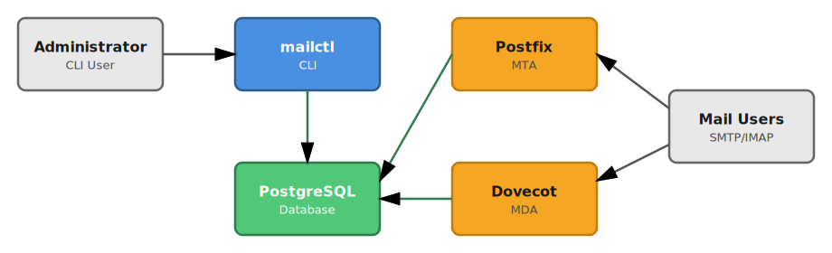

# mailctl
Another mail system configuration manager for Postfix/Dovecot and other MTAs/MDAs, but written in Go and easily deployable within modern infrastructure.

## Features
- **Modern CLI-Interface**: Intuitive command-line interface for managing your mail server.
- **Commonly-used Mail Features**:
    - Dynamic domain configuration
    - Mailbox and alias management (including send as)
    - Foreign alias targets
    - Catchall addresses (including optional fallback-only)
    - Relayed domains and recipients
    - Relay MTA login and access control
- **Broad Compatibility**: Native support for Postfix, Dovecot, and Stalwart.
- **Safety & Consistency**:
    - Soft- and Hard-Deletions.
    - Strong consistency enforcement.
    - Easy renaming of almost all objects.

## Architecture

`mailctl` acts as a management layer between administrators and mail services (Postfix/Dovecot), using PostgreSQL as the central configuration store with native SQL functions for mail routing and authentication.



### How it works

1. **Administrator** uses the `mailctl` CLI to manage mail configuration (domains, mailboxes, aliases, etc.)
2. **mailctl** stores all configuration in a **PostgreSQL database** with a well-defined schema
3. **Postfix** (MTA) queries database functions for mail routing decisions (transport maps, virtual aliases, relay domains, etc.)
4. **Dovecot** (MDA) queries database functions for user authentication and mailbox information
5. **Mail clients** connect to Postfix/Dovecot to send and receive email

This architecture provides:
- **Single source of truth**: All mail configuration in one database
- **Real-time updates**: Changes via `mailctl` are immediately available to Postfix/Dovecot
- **Security**: Dedicated database users with minimal permissions for each service
- **Scalability**: Database can be replicated, services can be distributed

## Prerequisites
- PostgreSQL 17+
- Postfix 3.6+ (for MTA integration)
- Dovecot 2.4+ (for MDA integration)

## Installation

### From Source
Ensure you have Go installed (version 1.25.2+ recommended).
```bash
go install github.com/gerolf-vent/mailctl/cmd/mailctl@latest
```

Or clone the repository and build manually:
```bash
git clone https://github.com/gerolf-vent/mailctl.git
cd mailctl
go build -o mailctl ./cmd/mailctl
```

## Getting Started
1. **Set up PostgreSQL**: Ensure you have PostgreSQL 17+ running.
2. **Configure Environment**: Export the necessary environment variables.
   ```bash
   export DB_HOST=localhost
   export DB_USER=myuser
   export DB_PASSWORD=mypassword
   export DB_NAME=mail_db
   ```
3. **Initialize Schema**: Run the schema upgrade command to create the necessary tables.
   ```bash
   mailctl schema upgrade
   ```

## Documentation
- **[CLI Reference](docs/cli/README.md)**
- **[Postfix Integration](docs/integrations/POSTFIX.md)**
- **[Dovecot Integration](docs/integrations/DOVECOT.md)**
- **[Database Schema](docs/internals/DATABASE_SCHEMA.md)**
