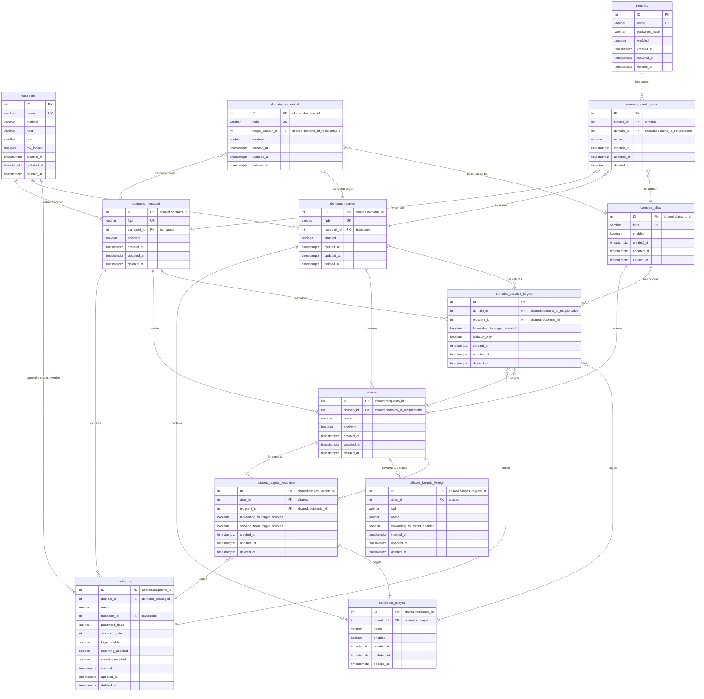

# Database Schema

## Schema Overview

### Core Concepts

#### Transports
Define how mail is delivered (SMTP, LMTP, etc.). Used by domains and can be overridden per mailbox.

#### Domain Types
- **Managed Domains**: Fully managed domains with mailboxes and aliases
- **Relayed Domains**: Domains that relay mail to external systems
- **Alias Domains**: Domains that only contain aliases
- **Canonical Domains**: Domain name mappings for address rewriting

#### Recipients
- **Mailboxes**: Actual email accounts with storage and authentication
- **Aliases**: Email addresses that forward to other recipients (internal or external)
- **Relayed Recipients**: Specific recipients on relayed domains

#### Remotes
External systems or users that can authenticate and send mail through specific grants.

### Soft Deletes

All tables support soft deletes via the `deleted_at` timestamp field. This allows for:
- Data recovery
- Audit trails
- Preventing cascading deletes from breaking audit logs

### Shared ID Sequences

The schema uses shared sequences for:
- **domains_id**: Unique IDs across all domain types
- **domains_id_recipientable**: Subset of domains that can have recipients (managed, relayed, alias)
- **recipients_id**: Unique IDs across mailboxes, aliases, and relayed recipients
- **aliases_targets_id**: Unique IDs across all alias target types

This ensures global uniqueness while allowing polymorphic relationships.

## Integration

See documentation for integration with:
- [Postfix](../integrations/POSTFIX.md)
- [Dovecot](../integrations/DOVECOT.md)
